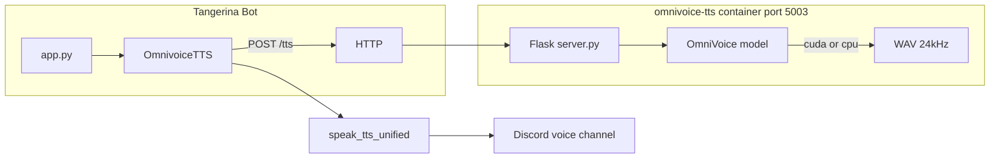

# OmniVoice TTS Integration Design

**Date:** 2026-06-10  
**Status:** Approved  
**Project:** Tangerina Discord Bot

## Summary

Add [OmniVoice](https://github.com/k2-fsa/OmniVoice) as a third local TTS provider alongside ElevenLabs and Piper. OmniVoice runs in a dedicated Docker sidecar with a Flask HTTP API. The main bot communicates via `OMNIVOICE_API_URL`, using **voice design** mode with a fixed `instruct` string for a consistent persona. The sidecar prefers GPU (CUDA) and falls back to CPU when no GPU is available.

## Background

### What is OmniVoice?

OmniVoice is an open-source, massively multilingual zero-shot TTS model (600+ languages) from k2-fsa. It supports:

- **Auto voice** — text only, model picks a voice
- **Voice design** — describe voice via `instruct` (gender, accent, pitch, etc.)
- **Voice cloning** — reference audio + transcript

This integration uses **voice design only** with a fixed `instruct` environment variable.

### Current TTS architecture

| Provider | Type | Integration |
|----------|------|-------------|
| ElevenLabs | Cloud API | `elevenlabs` library in `app.py` |
| Piper | Local | Subprocess or HTTP sidecar on port 5001 |

New providers follow the Piper pattern: a class with `generate_speech(text) -> wav_path`, registration in `app.py`, and dispatch in `speak_tts_unified()` (`features/tts/tts_handler.py`).

## Decisions

| Decision | Choice | Rationale |
|----------|--------|-----------|
| Deployment | Docker sidecar | Matches Piper; keeps PyTorch out of main bot image |
| Voice mode | Voice design (fixed `instruct`) | Consistent bot persona without reference audio |
| Compute | GPU preferred, CPU fallback | Fast inference when GPU available; works on dev machines without NVIDIA |
| Voice commands | Keep Piper | Low-latency listening mode unchanged; OmniVoice opt-in via `TTS_PROVIDER` |

## Architecture



## Components

### New: `deploy/omnivoice/`

| File | Responsibility |
|------|----------------|
| `Dockerfile` | Python 3.11, PyTorch (CUDA-capable), `omnivoice` package |
| `server.py` | Flask API: `GET /health`, `POST /tts` |
| `entrypoint.sh` | Device detection, model preload/warmup on startup |
| `docker-compose.yml` | Standalone compose for testing the sidecar alone |

### New: `features/tts/omnivoice_tts.py`

`OmnivoiceTTS` class — HTTP client mirroring `PiperTTS` HTTP mode:

```python
class OmnivoiceTTS:
    def generate_speech(self, text: str, output_path: Optional[str] = None) -> str:
        # POST OMNIVOICE_API_URL/tts, save WAV, return path
```

### Modified files

| File | Change |
|------|--------|
| `app.py` | Register `omnivoice` provider when `TTS_PROVIDER=omnivoice` |
| `features/tts/tts_handler.py` | Add `omnivoice` branch in `speak_tts_unified` |
| `flask_routes.py` | Add `POST /tts/omnivoice/speak` |
| `deploy/docker-compose.yaml` | Add `omnivoice-tts` service on port 5003 |
| `.env.example` | Document OmniVoice env vars |
| `README.md` | Full install and configure section |
| `chatbot/model_helper.py` | Update `TTSSpeak` tool description |

**Not modified:** `requirements.txt` (OmniVoice/PyTorch stay in sidecar only). Main bot uses `requests` for HTTP calls (already required for Piper HTTP mode).

## Sidecar API

### `GET /health`

Returns 200 when model is loaded and ready; 503 during warmup.

```json
{
  "status": "ok",
  "device": "cuda:0",
  "model": "k2-fsa/OmniVoice",
  "instruct": "female, brazilian accent"
}
```

### `POST /tts`

**Request:**
```json
{ "text": "Olá, tudo bem?" }
```

**Response:** `audio/wav` (24 kHz mono)

**Generation (server-side):**
```python
audio = model.generate(
    text=text,
    instruct=os.environ["OMNIVOICE_INSTRUCT"],
    num_step=int(os.getenv("OMNIVOICE_NUM_STEP", "16")),
    speed=float(os.getenv("OMNIVOICE_SPEED", "1.0")),
)
```

Text is sanitized (emoji/control chars removed) using the same approach as `deploy/piper/server.py`.

## Environment variables

### Bot (`.env`)

| Variable | Default | Purpose |
|----------|---------|---------|
| `TTS_PROVIDER` | `elevenlabs` | Set to `omnivoice` to activate |
| `OMNIVOICE_API_URL` | — | Sidecar URL, e.g. `http://omnivoice-tts:5003` or `http://localhost:5003` |
| `OMNIVOICE_TIMEOUT` | `90` | HTTP client timeout in seconds |

### Sidecar (container env)

| Variable | Default | Purpose |
|----------|---------|---------|
| `OMNIVOICE_INSTRUCT` | `female, brazilian accent` | Fixed voice design string |
| `OMNIVOICE_MODEL` | `k2-fsa/OmniVoice` | HuggingFace model ID |
| `OMNIVOICE_DEVICE` | `auto` | `auto`, `cuda`, `cpu`, or `mps` |
| `OMNIVOICE_NUM_STEP` | `16` | Diffusion steps (16 faster, 32 higher quality) |
| `OMNIVOICE_SPEED` | `1.0` | Speech rate multiplier |
| `HF_TOKEN` | — | Optional, faster HuggingFace downloads |
| `HF_ENDPOINT` | — | Optional mirror if HuggingFace is blocked |

### Device auto-detection

When `OMNIVOICE_DEVICE=auto`:

1. Try CUDA (`cuda:0`) if `torch.cuda.is_available()`
2. Else try MPS if available (Apple Silicon; not used in Docker but supported in standalone)
3. Else CPU

Dtype: `float16` on GPU, `float32` on CPU. Device choice is logged at startup and exposed in `/health`.

On GPU OOM during inference, the sidecar retries once on CPU for that request.

## Docker Compose

New service in `deploy/docker-compose.yaml`:

```yaml
omnivoice-tts:
  build:
    context: ./omnivoice
    dockerfile: Dockerfile
  container_name: tangerina-omnivoice-tts
  restart: unless-stopped
  environment:
    - OMNIVOICE_INSTRUCT=${OMNIVOICE_INSTRUCT:-female, brazilian accent}
    - OMNIVOICE_DEVICE=auto
    - OMNIVOICE_MODEL=${OMNIVOICE_MODEL:-k2-fsa/OmniVoice}
    - OMNIVOICE_NUM_STEP=${OMNIVOICE_NUM_STEP:-16}
    - OMNIVOICE_SPEED=${OMNIVOICE_SPEED:-1.0}
    - HF_TOKEN=${HF_TOKEN:-}
  ports:
    - "5003:5003"
  volumes:
    - omnivoice_cache:/root/.cache/huggingface
  networks:
    - tangerina-network
  deploy:
    resources:
      reservations:
        devices:
          - driver: nvidia
            count: 1
            capabilities: [gpu]
  healthcheck:
    test: ["CMD", "curl", "-f", "http://localhost:5003/health"]
    interval: 30s
    timeout: 10s
    retries: 3
    start_period: 300s
```

Bot service addition:
```yaml
environment:
  - OMNIVOICE_API_URL=${OMNIVOICE_API_URL:-http://omnivoice-tts:5003}
```

New volume: `omnivoice_cache` for HuggingFace model weights.

GPU reservation is optional — without `nvidia-container-toolkit`, Docker ignores the device block and the sidecar runs on CPU.

## Bot playback integration

In `speak_tts_unified`, the `omnivoice` branch:

- Calls `OmnivoiceTTS.generate_speech(text)` via `asyncio.to_thread`
- Uses `use_ffmpeg_direct=True` (WAV, same as Piper)
- Constants: `OMNIVOICE_CLEANUP_DELAY=10`, `OMNIVOICE_MIXED_VOLUME=0.2`
- FFmpeg resamples 24 kHz WAV to Discord's 48 kHz PCM

Provider selection at startup (`app.py`):

```python
elif TTS_PROVIDER == 'omnivoice' and OmnivoiceTTS:
    tts_providers['omnivoice'] = OmnivoiceTTS()
```

## Data flow

1. Chatbot, Flask API, or command triggers `speak_tts(guild_id, channel_id, text)`
2. `OmnivoiceTTS.generate_speech()` sends `POST /tts` to sidecar
3. Sidecar runs `model.generate(text, instruct=OMNIVOICE_INSTRUCT)`
4. WAV returned to bot, saved to temp file
5. `speak_tts_unified` joins voice channel, plays via `FFmpegPCMAudio`
6. Temp file deleted after playback delay

## Error handling

| Scenario | Behavior |
|----------|----------|
| Sidecar unreachable | `RuntimeError` with connection message; `{success: false}` to caller |
| Empty or emoji-only text | 400 from sidecar |
| Inference timeout (>90s default) | 504 from sidecar |
| GPU OOM | Sidecar retries inference on CPU once |
| Model not yet loaded | `/health` returns 503; healthcheck `start_period: 300s` |
| Missing `OMNIVOICE_API_URL` when provider is omnivoice | Startup warning; provider disabled |

## Voice commands (out of scope)

`features/voice/voice_commands.py` continues using Piper via `speak_piper_tts_func`. OmniVoice is activated via `TTS_PROVIDER=omnivoice` or `POST /tts/omnivoice/speak`. Extending listening mode to OmniVoice is a future enhancement.

## Installation and configuration (ready to run)

### Prerequisites

- Docker and Docker Compose
- Optional: NVIDIA GPU + [nvidia-container-toolkit](https://docs.nvidia.com/datacenter/cloud-native/container-toolkit/install-guide.html) for GPU acceleration
- ~10 GB disk for model cache
- 8 GB+ RAM (16 GB recommended)

### Full stack

```bash
cd deploy
docker compose up -d omnivoice-tts
# Wait for health (first start downloads ~2-4 GB model, up to ~5 min)
docker compose logs -f omnivoice-tts
```

Configure `.env`:
```env
TTS_PROVIDER=omnivoice
OMNIVOICE_API_URL=http://omnivoice-tts:5003
OMNIVOICE_INSTRUCT=female, brazilian accent
```

Start bot:
```bash
docker compose up -d tangerina-bot
```

### Standalone sidecar (testing)

```bash
cd deploy/omnivoice
docker compose up --build
curl http://localhost:5003/health
curl -X POST http://localhost:5003/tts \
  -H "Content-Type: application/json" \
  -d '{"text":"Olá, este é um teste."}' \
  -o test.wav
```

### Local bot without Docker (sidecar in Docker)

```env
TTS_PROVIDER=omnivoice
OMNIVOICE_API_URL=http://localhost:5003
OMNIVOICE_INSTRUCT=female, brazilian accent
```

## Testing

| Level | Test |
|-------|------|
| Sidecar health | `curl -f http://localhost:5003/health` |
| Sidecar TTS | `curl -X POST .../tts -d '{"text":"teste"}' -o out.wav` |
| Flask route | `POST /tts/omnivoice/speak` with `guild_id`, `channel_id`, `text` |
| Integration | Set `TTS_PROVIDER=omnivoice`, trigger `TTSSpeak` chatbot tool |

Existing `tests/integration/test_flask_routes.py` pattern can be extended for request validation on the new route.

## Risks and mitigations

| Risk | Mitigation |
|------|------------|
| Slow CPU inference | Document GPU recommendation; use `OMNIVOICE_NUM_STEP=16` |
| Long first startup | `start_period: 300s` healthcheck; model preload in entrypoint |
| Large image size | Isolated sidecar; not in main bot image |
| Voice design instability for pt-BR | Default `instruct` tuned for Brazilian Portuguese; user can override |
| HuggingFace download failures | Document `HF_TOKEN` and `HF_ENDPOINT` mirror |

## References

- [k2-fsa/OmniVoice](https://github.com/k2-fsa/OmniVoice)
- [omnivoice on PyPI](https://pypi.org/project/omnivoice/)
- [Voice design attributes](https://github.com/k2-fsa/OmniVoice/blob/master/docs/voice-design.md)
- Existing Piper sidecar: `deploy/piper/`
